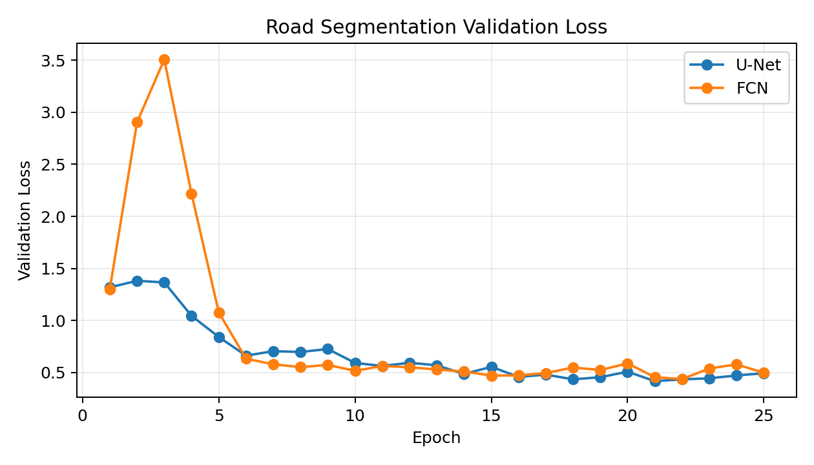
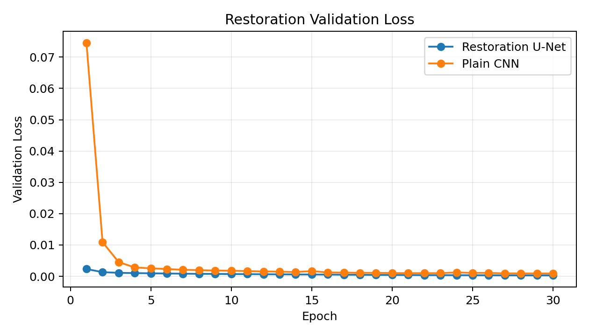

# U-Net CamVid 道路场景分割与图像清晰度还原

本仓库是机器学习课程大作业项目，主题是 **U-Net 在真实道路场景图像分割与清晰度还原中的应用**。当前主方案已切换为公开道路数据集 **CamVid**，不再使用生成道路数据作为主要结论。

主脚本：`run_road_experiments.py`  
主输出目录：`outputs_camvid/`

## 项目目标

本项目围绕两个对比实验展开：

1. **道路场景语义分割**：用 CamVid 真实驾驶场景图像，将像素映射为 `background / road / vehicle / obstacle` 四类，并比较 U-Net 与 FCN。
2. **图像清晰度还原**：对真实道路图像进行低清、模糊、噪声退化，比较 Restoration U-Net 与 Plain CNN 的还原效果。

CamVid 是公开驾驶场景语义分割数据集，包含街景道路图像和像素级标签。它比生成数据更适合课程汇报，因为任务场景明确，对应自动驾驶、辅助驾驶、道路巡检和移动机器人导航等应用。

## 数据集说明

默认使用 `camvid_tiny`，这是 CamVid 的小规模真实子集，下载快、复现稳定，适合课程展示。脚本也支持完整 CamVid：

```bash
python run_road_experiments.py --seg-dataset camvid --output-dir outputs_camvid_full
```

完整 CamVid 约 599MB，首次运行会自动下载到 `data/`。`data/` 已被 `.gitignore` 忽略，不会提交到仓库。

类别映射：

| 项目类别 | CamVid 原始类别示例 |
|---|---|
| `background` | Sky, Building, Tree, Wall, Tunnel 等 |
| `road` | Road, RoadShoulder, Sidewalk, LaneMkgsDriv, LaneMkgsNonDriv |
| `vehicle` | Car, SUVPickupTruck, Truck_Bus, Train, MotorcycleScooter |
| `obstacle` | Pedestrian, Bicyclist, TrafficCone, TrafficLight, SignSymbol, Column_Pole, Fence 等 |

## 项目结构

```text
.
├── run_road_experiments.py
├── report.md
├── README.md
├── requirements.txt
├── img/
│   └── README.md
└── outputs_camvid/
    ├── metrics.json
    └── figures/
        ├── segmentation_examples.png
        ├── segmentation_loss.png
        ├── restoration_examples.png
        └── restoration_loss.png
```

核心文件：

| 文件 | 作用 |
|---|---|
| `run_road_experiments.py` | 下载/读取 CamVid，训练 U-Net/FCN，训练还原模型，保存指标和图片 |
| `report.md` | 课程报告正文 |
| `outputs_camvid/metrics.json` | 当前实验配置、指标、训练历史 |
| `outputs_camvid/figures/segmentation_examples.png` | 分割结果对比图 |
| `outputs_camvid/figures/restoration_examples.png` | 图像还原结果对比图 |
| `img/` | 可放入 2-3 张自选图片用于还原实验；若为空，脚本使用 CamVid 图片 |

## 环境准备

```bash
pip install -r requirements.txt
```

主要依赖：

- `torch`
- `torchvision`
- `numpy`
- `Pillow`
- `matplotlib`
- `scikit-image`
- `tqdm`

脚本会自动检测 CUDA。有可用 GPU 时使用 CUDA，否则使用 CPU。

## 复现实验

当前仓库结果使用以下命令生成：

```bash
python run_road_experiments.py --seg-dataset camvid_tiny --epochs 25 --train-count 80 --val-count 20 --restore-train-count 96 --restore-val-count 12 --batch-size 8 --size 96 --output-dir outputs_camvid
```

输出文件：

```text
outputs_camvid/metrics.json
outputs_camvid/figures/segmentation_examples.png
outputs_camvid/figures/segmentation_loss.png
outputs_camvid/figures/restoration_examples.png
outputs_camvid/figures/restoration_loss.png
```

## 当前实验结果

### 分割总指标

| 模型 | mIoU(all) | mIoU(foreground) | Pixel Accuracy | 参数量 |
|---|---:|---:|---:|---:|
| U-Net | 0.6569 | 0.5803 | 0.9126 | 117,732 |
| FCN | 0.6128 | 0.5297 | 0.8946 | 35,894 |

### 分割类别 IoU

| 类别 | U-Net IoU | FCN IoU |
|---|---:|---:|
| background | 0.8866 | 0.8619 |
| road | 0.9126 | 0.8916 |
| vehicle | 0.6299 | 0.5335 |
| obstacle | 0.1985 | 0.1642 |

分割可视化：


分割验证损失：



结论：在真实 CamVid 道路图像上，U-Net 的整体 mIoU、前景 mIoU 和像素准确率均高于 FCN。车辆和障碍物这类小目标仍然较难，但 U-Net 由于有 skip connection，表现更稳定。

### 清晰度还原指标

| 模型/输入 | MSE | PSNR | SSIM | 参数量 |
|---|---:|---:|---:|---:|
| Degraded input | 0.001038 | 29.9817 | 0.7965 | - |
| Restoration U-Net | 0.000283 | 35.7171 | 0.9277 | 117,715 |
| Plain CNN | 0.000894 | 30.5045 | 0.8872 | 20,259 |

还原可视化：


还原验证损失：



结论：Restoration U-Net 在 MSE、PSNR、SSIM 上都优于退化输入和 Plain CNN。Plain CNN 倾向于输出更平滑的图像，U-Net 能保留更多结构并修正退化。

## 汇报建议

建议 PPT 按下面顺序组织：

1. **研究背景**：道路场景理解用于自动驾驶、辅助驾驶、道路巡检。
2. **数据集**：CamVid 真实驾驶场景，像素级语义标签。
3. **任务定义**：四类分割：background、road、vehicle、obstacle；以及低清图还原。
4. **模型结构**：U-Net 的编码器、解码器和 skip connection；FCN 作为无跳跃连接基线。
5. **训练设置**：CamVid Tiny、96x96 输入、类别权重 Cross Entropy、MSE 还原损失。
6. **分割结果**：指标表 + `segmentation_examples.png`。
7. **还原结果**：指标表 + `restoration_examples.png`。
8. **结论与不足**：真实数据更难但更有说服力；障碍物类样本少，后续可换完整 CamVid 或 Cityscapes。

三人分工建议：

| 成员 | 负责内容 |
|---|---|
| 成员 A | U-Net 原理、skip connection、模型结构 |
| 成员 B | CamVid 数据集、类别映射、训练流程 |
| 成员 C | 实验结果、可视化、结论与不足 |

## 后续改进

- 使用完整 CamVid 训练更多样本；
- 换 Cityscapes 或 BDD100K 做更大规模实验；
- 对障碍物类别增加样本或重新细分类别；
- 尝试 DeepLabV3、SegNet、U-Net++ 等分割网络；
- 还原任务加入 L1 Loss、SSIM Loss 或感知损失。
