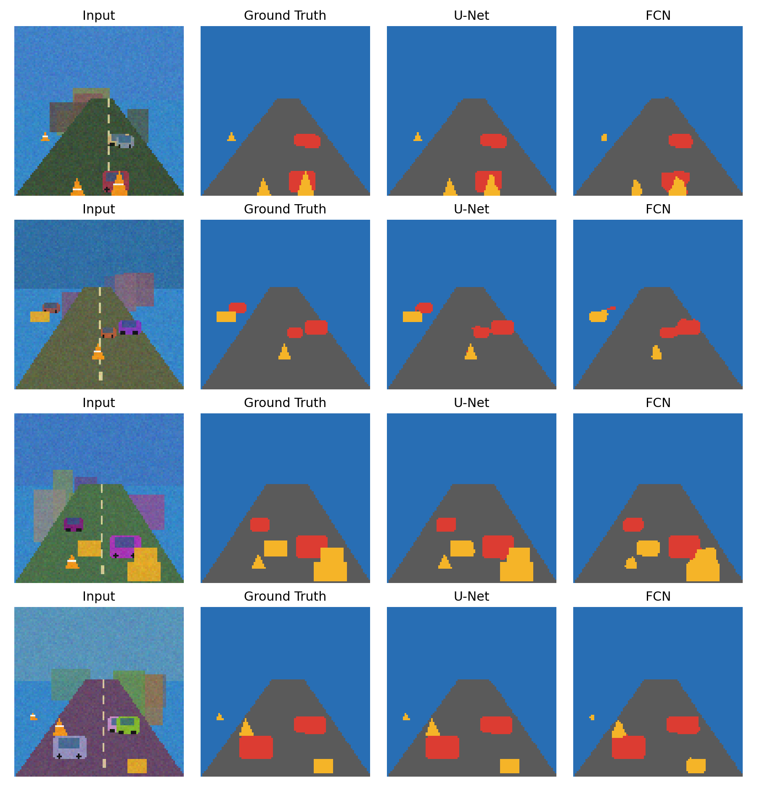
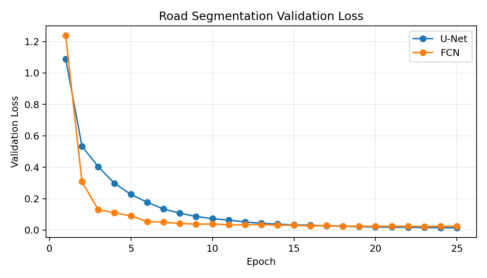
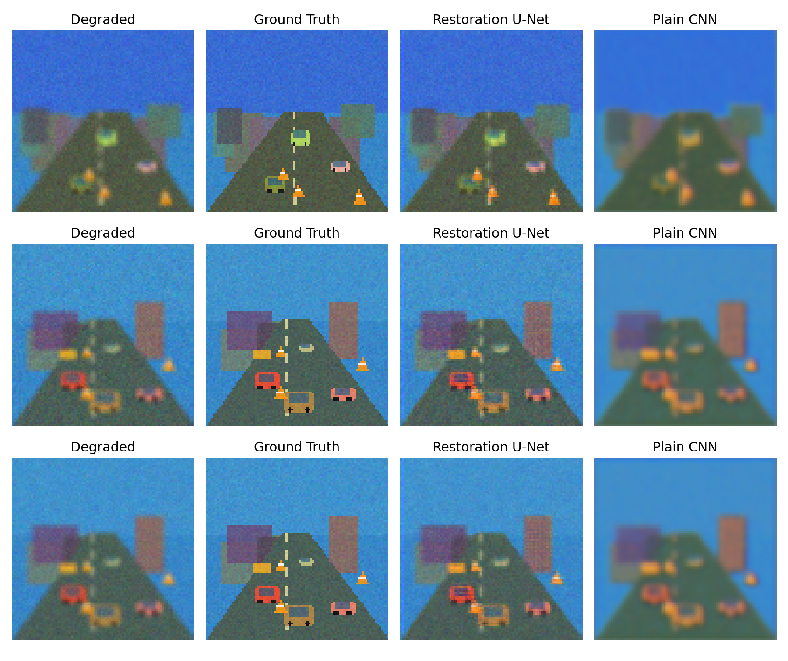
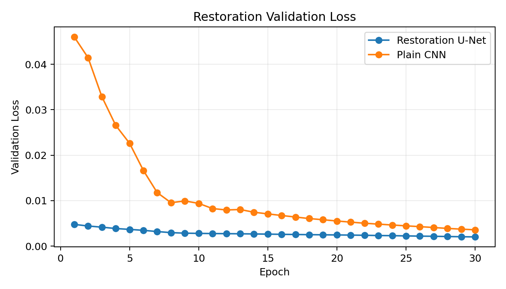

# U-Net Road Scene Segmentation and Image Restoration

本仓库是机器学习课程大作业项目，主题是 **U-Net 在道路场景图像分割与清晰度还原中的应用**。当前方案已切换为公路/道路应用场景，重点分割 **地面/道路、车辆、障碍物**，并用 U-Net 和基线网络做效果对比。

当前实验不再使用宠物分割方案。主脚本是 `run_road_experiments.py`，输出目录是 `outputs_road/`。

## 项目目标

本项目围绕两个问题展开：

1. **道路场景语义分割**：比较 U-Net 和轻量 FCN 在道路、车辆、障碍物分割上的差异。
2. **图像清晰度还原**：比较残差式 Restoration U-Net 和 Plain CNN 对低清/模糊/噪声图片的还原效果。

道路场景有明确应用背景，包括自动驾驶环境感知、辅助驾驶、道路巡检、移动机器人导航等。相比普通几何图形或宠物前景分割，这个任务更适合汇报“模型为什么有实际价值”。

## 当前实验设计

### 1. 道路场景分割

脚本会生成可控道路场景数据，每张图包含天空/背景、道路、车辆、障碍物等元素，并同步生成像素级标签。

分割类别如下：

| 类别 ID | 类别 | 含义 | 可视化颜色 |
|---:|---|---|---|
| 0 | `background` | 天空、建筑、远处背景 | 蓝色 |
| 1 | `road` | 可行驶路面/地面 | 灰色 |
| 2 | `vehicle` | 车辆目标 | 红色 |
| 3 | `obstacle` | 路障、锥桶、箱体等障碍物 | 黄色 |

对比模型：

| 模型 | 作用 | 关键区别 |
|---|---|---|
| U-Net | 主模型 | 编码器-解码器结构，带同尺度 skip connection |
| FCN | 分割基线 | 也做下采样和上采样，但没有 U-Net 式跳跃连接 |

### 2. 图像清晰度还原

脚本会优先读取 `img/` 目录下最多 3 张图片，用作清晰目标图；然后自动构造退化图像，包括降采样、上采样、Gaussian Blur 和随机噪声。

如果当前没有 `img/` 图片，脚本会自动使用 3 张生成道路图作为占位图。当前仓库结果就是这种状态：**还原实验暂用 3 张生成道路图占位**。后续只要把 2-3 张图片放进 `img/` 后重跑同一条命令，结果会自动更新。

对比模型：

| 模型 | 作用 | 关键区别 |
|---|---|---|
| Restoration U-Net | 还原主模型 | 预测残差修正量，保留输入结构并修复细节 |
| Plain CNN | 还原基线 | 只用连续卷积层，没有多尺度编码/解码结构 |

## 项目结构

```text
.
├── run_road_experiments.py
├── report.md
├── README.md
├── requirements.txt
├── img/
│   └── README.md
└── outputs_road/
    ├── metrics.json
    └── figures/
        ├── segmentation_examples.png
        ├── segmentation_loss.png
        ├── restoration_examples.png
        └── restoration_loss.png
```

核心文件说明：

| 文件 | 作用 |
|---|---|
| `run_road_experiments.py` | 主实验脚本，包含数据生成、模型定义、训练、评估和可视化 |
| `report.md` | 课程报告正文，可直接继续补充姓名、学号、课程信息 |
| `outputs_road/metrics.json` | 完整实验配置、指标和训练历史 |
| `outputs_road/figures/segmentation_examples.png` | 分割效果对比图 |
| `outputs_road/figures/restoration_examples.png` | 清晰度还原效果对比图 |
| `img/` | 可放入 2-3 张真实图片，用于清晰度还原实验 |

## 环境准备

建议使用 Python 3.10 以上版本。安装依赖：

```bash
pip install -r requirements.txt
```

主要依赖：

- `torch`
- `numpy`
- `Pillow`
- `matplotlib`
- `scikit-image`
- `tqdm`

脚本会自动检测 CUDA。如果本机 PyTorch 支持 CUDA，就使用 GPU；否则使用 CPU。

## 复现实验

在仓库根目录运行：

```bash
python run_road_experiments.py --epochs 25 --train-count 768 --val-count 192 --restore-train-count 96 --restore-val-count 12 --batch-size 32 --size 96 --output-dir outputs_road
```

参数说明：

| 参数 | 含义 | 当前值 |
|---|---|---:|
| `--epochs` | 分割模型训练轮数 | 25 |
| `--train-count` | 分割训练样本数 | 768 |
| `--val-count` | 分割验证样本数 | 192 |
| `--restore-train-count` | 还原训练样本数 | 96 |
| `--restore-val-count` | 还原验证样本数 | 12 |
| `--batch-size` | 批大小 | 32 |
| `--size` | 输入图片尺寸 | 96 |
| `--output-dir` | 输出目录 | `outputs_road` |

重跑后会覆盖生成：

```text
outputs_road/metrics.json
outputs_road/figures/segmentation_examples.png
outputs_road/figures/segmentation_loss.png
outputs_road/figures/restoration_examples.png
outputs_road/figures/restoration_loss.png
```

## 当前结果

### 分割总指标

| 模型 | mIoU(all) | mIoU(foreground) | Pixel Accuracy | 参数量 |
|---|---:|---:|---:|---:|
| U-Net | 0.9864 | 0.9822 | 0.9984 | 117,732 |
| FCN | 0.9315 | 0.9103 | 0.9916 | 35,894 |

结论：U-Net 在整体 mIoU、前景 mIoU 和像素准确率上都高于 FCN。差距主要来自车辆和障碍物这类小目标，说明 skip connection 对恢复边界和小目标位置有帮助。

### 分割类别 IoU

| 类别 | U-Net IoU | FCN IoU |
|---|---:|---:|
| background | 0.9990 | 0.9949 |
| road | 0.9967 | 0.9787 |
| vehicle | 0.9659 | 0.8815 |
| obstacle | 0.9839 | 0.8708 |

分割可视化：



分割验证损失：



### 清晰度还原指标

| 模型/输入 | MSE | PSNR | SSIM | 参数量 |
|---|---:|---:|---:|---:|
| Degraded input | 0.002626 | 25.8711 | 0.6207 | - |
| Restoration U-Net | 0.002027 | 26.9868 | 0.6453 | 117,715 |
| Plain CNN | 0.003586 | 24.4707 | 0.5937 | 20,259 |

结论：Restoration U-Net 相比退化输入和 Plain CNN 都取得了更低 MSE、更高 PSNR 和更高 SSIM。Plain CNN 输出更平滑，但细节恢复能力弱；U-Net 的残差结构更适合在保留原图主体结构的同时修正模糊和噪声。

还原可视化：



还原验证损失：



## 汇报建议

建议 PPT 按 8 页组织：

1. **研究背景**：道路场景分割用于自动驾驶、道路巡检、机器人导航。
2. **任务定义**：输入道路图像，输出 road/vehicle/obstacle/background 像素级类别；低清图输入，输出清晰图。
3. **U-Net 原理**：编码器提语义，解码器恢复分辨率，skip connection 补回空间细节。
4. **实验数据**：道路场景样本、四类标签、还原任务的退化方式。
5. **模型对比**：U-Net vs FCN；Restoration U-Net vs Plain CNN。
6. **分割结果**：放指标表和 `segmentation_examples.png`。
7. **还原结果**：放指标表和 `restoration_examples.png`。
8. **结论与不足**：U-Net 对小目标和边界更稳定；真实图片补充后可进一步提高说服力。

三人分工建议：

| 成员 | 负责内容 |
|---|---|
| 成员 A | 讲研究背景、U-Net 结构、skip connection 原理 |
| 成员 B | 讲数据集构造、训练流程、代码复现方法 |
| 成员 C | 讲实验结果、可视化对比、结论和不足 |

汇报时可以重点说：

- 本项目不是只跑一个 U-Net，而是做了两个对比实验。
- 分割任务证明 U-Net 对小目标和边界更好，车辆和障碍物 IoU 明显高于 FCN。
- 还原任务证明残差式 U-Net 对低清图修复优于普通 CNN。
- 当前 `img/` 暂无真实图片，所以还原部分先用生成道路图占位；补入真实图片后脚本可直接复现。

## 后续可改进

如果时间允许，建议补充 2-3 张真实道路图片到 `img/`，然后重跑脚本。这样还原部分会更贴近组员提出的要求。

更进一步可以替换为公开道路数据集，例如 CamVid、Cityscapes 或 BDD100K 的小规模子集；但这些数据集通常需要下载和整理标注，课程作业时间紧时可以先用当前可控道路场景完成对比实验。
