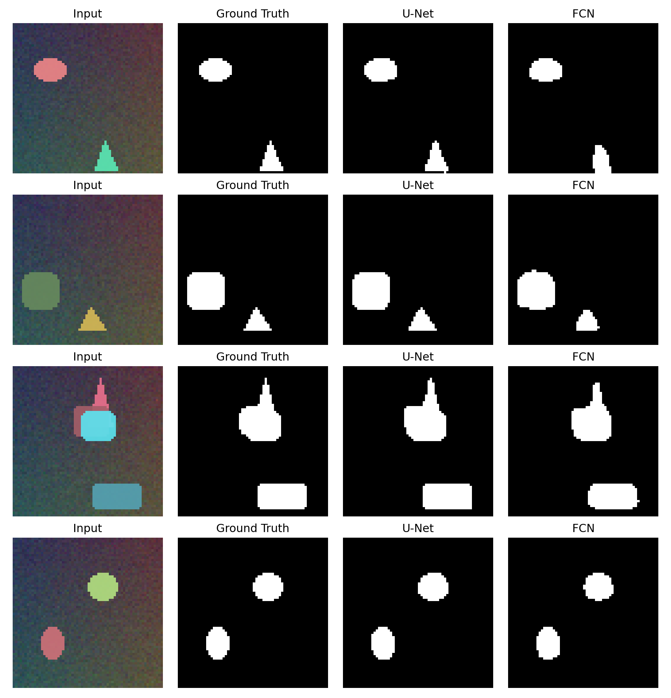
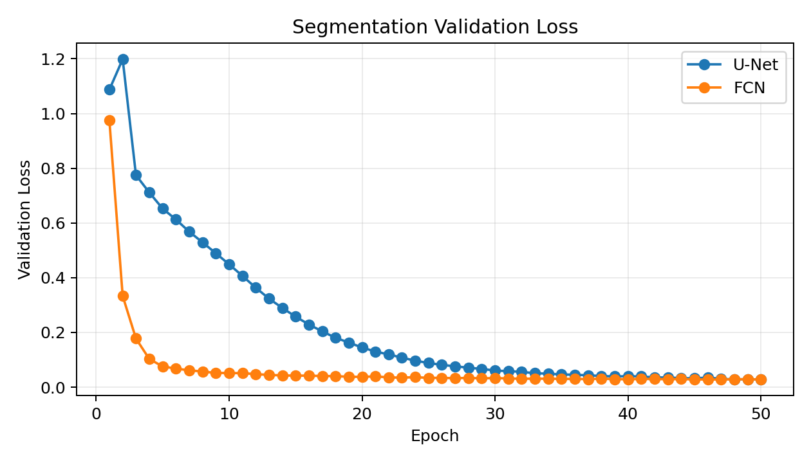
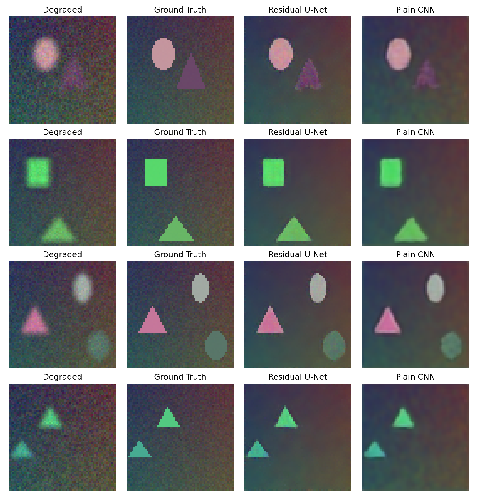
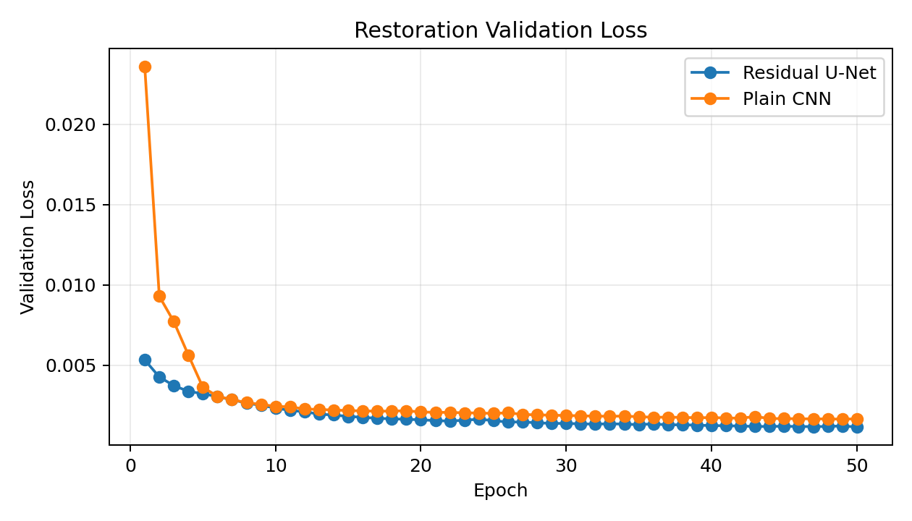

# U-Net 图像分割与图像清晰度还原课程实验

本仓库是机器学习课程大作业项目，主题为 **U-Net**。项目包含两组实验：

1. **图像分割实验**：比较 U-Net 与轻量 FCN 在像素级目标分割任务上的效果。
2. **图像清晰度还原实验**：比较 U-Net 与 Plain CNN 在模糊、噪声、降采样退化图像上的恢复效果。

项目已经包含可运行代码、实验指标、结果图片和 Markdown 报告，组员可以直接基于本仓库做汇报材料。

## 项目结构

```text
.
├── run_experiments.py
├── report.md
├── README.md
├── requirements.txt
└── outputs
    ├── metrics.json
    └── figures
        ├── segmentation_examples.png
        ├── segmentation_loss.png
        ├── restoration_examples.png
        └── restoration_loss.png
```

| 文件 | 作用 |
|---|---|
| `run_experiments.py` | 主实验脚本，包含数据生成、模型定义、训练、评价、可视化保存 |
| `report.md` | 已写好的课程实验报告，可继续补充姓名、学号、课程信息 |
| `README.md` | 给组员看的项目说明和汇报指南 |
| `requirements.txt` | Python 依赖列表 |
| `outputs/metrics.json` | 实验配置、训练历史和最终指标 |
| `outputs/figures/segmentation_examples.png` | 分割任务可视化结果 |
| `outputs/figures/segmentation_loss.png` | 分割任务验证损失曲线 |
| `outputs/figures/restoration_examples.png` | 图像还原任务可视化结果 |
| `outputs/figures/restoration_loss.png` | 图像还原任务验证损失曲线 |

## 实验目标

U-Net 是一种经典的编码器-解码器结构，最初广泛用于医学图像分割。它的关键设计是 **跳跃连接**：将编码器中浅层、高分辨率的特征直接拼接到解码器对应尺度中，使模型既能利用深层语义信息，也能保留边界和空间细节。

本项目希望回答两个问题：

1. 在图像分割任务中，U-Net 相比普通编码器-解码器网络是否更适合恢复边界和小目标？
2. 在图像清晰度还原任务中，U-Net 是否一定优于普通 CNN？

实验结论比较适合汇报：U-Net 在分割任务中表现更好，但在低分辨率图像还原任务中，Plain CNN 的数值指标略优。这说明模型结构要和任务特点匹配，不能简单认为 U-Net 在所有图像到图像任务中都最优。

## 数据集说明

为了让课程作业可以稳定复现，本项目没有依赖外部公开数据集，而是使用脚本自动生成合成图像。

每张图像包含：

- 渐变背景；
- 随机噪声；
- 若干几何目标，包括圆形、矩形、三角形；
- 对应的二值分割掩膜。

分割任务：

- 输入：RGB 合成图像；
- 标签：目标区域二值 mask；
- 目标：判断每个像素是否属于前景目标。

图像还原任务：

- 先生成一张清晰合成图像；
- 再进行降采样、上采样、Gaussian Blur 和随机噪声扰动；
- 输入退化图像，输出尽可能接近原始清晰图像的结果。

这种数据设计的优点是可控、轻量、可复现，适合课程作业演示 U-Net 的结构特点。缺点是与真实自然图像或医学图像存在差距，报告中也已经写入了这个局限性。

## 模型说明

### U-Net

代码中的 `UNetSmall` 是一个小型 U-Net：

- 输入通道数：3；
- 两层下采样编码器；
- 一个瓶颈层；
- 两层上采样解码器；
- 解码阶段使用 skip connection 拼接编码器特征；
- 分割任务输出 1 通道；
- 图像还原任务输出 3 通道。

U-Net 的优势在于：下采样路径负责提取语义信息，上采样路径负责恢复分辨率，跳跃连接负责补回浅层边缘和位置信息。

### FCN 分割基线

分割对比模型是轻量 FCN：

- 有卷积、池化、上采样；
- 没有 U-Net 的同尺度跳跃连接；
- 参数量更少；
- 用来观察没有 skip connection 时分割边界和小目标的表现。

### Plain CNN 还原基线

图像还原对比模型是 Plain CNN：

- 由连续卷积层组成；
- 不进行池化和上采样；
- 始终保持原图空间分辨率；
- 更适合学习局部像素映射。

这也是为什么在当前图像还原实验中，Plain CNN 的 PSNR 和 SSIM 略高于 U-Net。

## 环境准备

建议使用 Python 3.10 以上版本。本机实验环境为 Python 3.13.13，并已成功运行。

安装依赖：

```bash
pip install -r requirements.txt
```

依赖包括：

- `torch`
- `numpy`
- `Pillow`
- `matplotlib`
- `scikit-image`
- `tqdm`

如果电脑有 NVIDIA GPU 且 PyTorch CUDA 可用，脚本会自动使用 CUDA；否则会使用 CPU。

## 如何复现实验

在仓库根目录运行：

```bash
python run_experiments.py --epochs 12 --train-count 256 --val-count 64 --batch-size 32 --size 64
```

参数含义：

| 参数 | 含义 | 当前实验值 |
|---|---|---:|
| `--epochs` | 训练轮数 | 12 |
| `--train-count` | 训练集图像数量 | 256 |
| `--val-count` | 验证集图像数量 | 64 |
| `--batch-size` | batch size | 32 |
| `--size` | 图像边长 | 64 |
| `--seed` | 随机种子 | 42 |
| `--output-dir` | 输出目录 | `outputs` |

运行后会覆盖并重新生成：

```text
outputs/metrics.json
outputs/figures/segmentation_examples.png
outputs/figures/segmentation_loss.png
outputs/figures/restoration_examples.png
outputs/figures/restoration_loss.png
```

如果只是做汇报，不需要重新跑实验，仓库里已经包含了一次完整实验结果。

## 当前实验结果

### 图像分割

| 模型 | mIoU | Dice | Pixel Accuracy | 参数量 |
|---|---:|---:|---:|---:|
| U-Net | 0.9507 | 0.9745 | 0.9933 | 66,469 |
| FCN | 0.9223 | 0.9592 | 0.9895 | 23,049 |

结论：

- U-Net 在 mIoU 和 Dice 上均优于轻量 FCN；
- U-Net 对小目标、多目标和边界恢复更稳定；
- 说明 skip connection 对像素级分割任务有明显帮助。

分割可视化：



分割损失曲线：



### 图像清晰度还原

| 模型/输入 | MSE | PSNR | SSIM | 参数量 |
|---|---:|---:|---:|---:|
| Degraded input | 0.003956 | 24.2339 | 0.4319 | - |
| U-Net | 0.003902 | 24.1839 | 0.6118 | 66,495 |
| Plain CNN | 0.003009 | 25.4140 | 0.6164 | 20,259 |

结论：

- U-Net 相比退化输入显著提高 SSIM，说明恢复了更多结构信息；
- Plain CNN 在 MSE、PSNR 和 SSIM 上略优；
- 当前任务是低分辨率局部退化恢复，Plain CNN 不下采样，能更好保留局部像素细节；
- 这说明 U-Net 适合分割，但不一定在所有图像还原任务中都最优。

还原可视化：



还原损失曲线：



## 汇报建议

建议 PPT 按下面顺序组织。

### 1. 研究背景

可以讲：

- 图像分割是像素级分类任务；
- U-Net 是图像分割中的经典网络；
- 它通过编码器-解码器结构提取多尺度特征；
- 跳跃连接可以保留浅层空间细节，改善边界预测。

建议配图：

- 放一张 U-Net 结构示意图；
- 或者自己画一个“下采样、瓶颈、上采样、跳跃连接”的简化结构图。

### 2. 实验问题

可以直接用这两个问题：

1. U-Net 在分割任务中是否比无跳跃连接的网络更好？
2. U-Net 在图像清晰度还原任务中是否也一定更好？

这样汇报不会只停留在“跑了一个模型”，而是有对比和思考。

### 3. 数据集构造

可以讲：

- 使用脚本自动生成合成图像；
- 图像包含随机几何图形和背景噪声；
- 分割标签是目标区域 mask；
- 清晰度还原任务将清晰图像退化后再训练恢复。

汇报时要说明：使用合成数据的原因是为了保证实验可控、轻量、可复现。

### 4. 模型对比

建议做一页表格：

| 任务 | 主模型 | 对比模型 | 对比重点 |
|---|---|---|---|
| 分割 | U-Net | FCN | 是否有跳跃连接 |
| 还原 | U-Net | Plain CNN | 是否进行下采样和上采样 |

讲解重点：

- U-Net 的 skip connection 对定位和边界有帮助；
- Plain CNN 更适合简单局部像素恢复；
- 不同任务适合不同结构。

### 5. 实验结果

分割部分重点讲：

- U-Net mIoU 为 0.9507；
- FCN mIoU 为 0.9223；
- U-Net 的 Dice 也更高；
- 可视化中 U-Net 目标形状更接近标签。

还原部分重点讲：

- U-Net 的 SSIM 从退化输入的 0.4319 提升到 0.6118；
- Plain CNN 的 SSIM 为 0.6164，略高于 U-Net；
- Plain CNN 的 PSNR 也更高；
- 这说明低层图像恢复任务不一定需要复杂下采样结构。

### 6. 结论

建议结论写成三点：

1. U-Net 在图像分割任务中效果较好，尤其适合需要精确定位的像素级预测任务。
2. 跳跃连接能够融合浅层空间细节和深层语义信息，是 U-Net 的关键优势。
3. 在图像清晰度还原任务中，Plain CNN 略优于 U-Net，说明模型选择应结合任务性质，而不是盲目选择复杂模型。

### 7. 局限性与改进

可以讲：

- 当前数据为合成图像，与真实数据存在差距；
- 图像尺寸较小，模型规模也较小；
- 训练轮数有限；
- 后续可以使用真实公开数据集，如医学图像、宠物分割、遥感图像；
- 图像还原任务可尝试 ResUNet、DnCNN、感知损失或 SSIM Loss。

## 组内分工建议

可以按下面方式分工：

| 成员 | 负责内容 |
|---|---|
| 成员 A | 讲 U-Net 背景、结构、skip connection |
| 成员 B | 讲数据集构造、实验设置、代码流程 |
| 成员 C | 讲分割实验结果和可视化 |
| 成员 D | 讲图像还原实验结果、局限性和总结 |

如果人数少，可以合并为：

- 一人讲背景和模型；
- 一人讲实验和结果；
- 一人讲分析和总结。

## 代码阅读入口

推荐按以下顺序读 `run_experiments.py`：

1. `draw_scene`：生成合成图像和分割 mask；
2. `degrade_image`：生成退化图像；
3. `SyntheticSegmentationDataset`：分割数据集；
4. `SyntheticRestorationDataset`：还原数据集；
5. `UNetSmall`：U-Net 模型结构；
6. `FCNSmall`：分割对比模型；
7. `PlainRestorationCNN`：图像还原对比模型；
8. `train_model`：训练函数；
9. `evaluate_segmentation` 和 `evaluate_restoration`：评价指标；
10. `save_*_examples`：保存可视化结果；
11. `main`：实验主流程。

## 常见问题

### 1. 为什么不用真实数据集？

课程作业更强调完整实验流程和模型对比。合成数据可以保证每个人都能直接运行，不依赖下载链接和复杂标注格式。报告中也指出了这是实验局限。

### 2. 为什么 U-Net 的还原效果没有 Plain CNN 好？

因为当前还原任务主要是局部像素级恢复，Plain CNN 始终保持原图分辨率，不会因为下采样损失细节。U-Net 更擅长融合语义和空间信息，所以在分割任务中优势更明显。

### 3. 可以把结果改得更漂亮吗？

可以增加训练轮数、增大数据集、调整模型宽度，或更换真实数据集。例如：

```bash
python run_experiments.py --epochs 30 --train-count 1024 --val-count 128 --batch-size 32 --size 64
```

但要注意，重新运行后 `outputs` 中的结果会被覆盖，报告里的数值也需要同步更新。

### 4. 汇报时最重要的一句话是什么？

U-Net 的核心优势是通过跳跃连接把浅层空间细节和深层语义信息结合起来，因此在图像分割这类需要精确定位的任务中表现更好；但在图像清晰度还原这种局部像素恢复任务中，简单 CNN 也可能更合适。

## 仓库地址

GitHub 私有仓库：

```text
https://github.com/Lev1z/Unet
```

