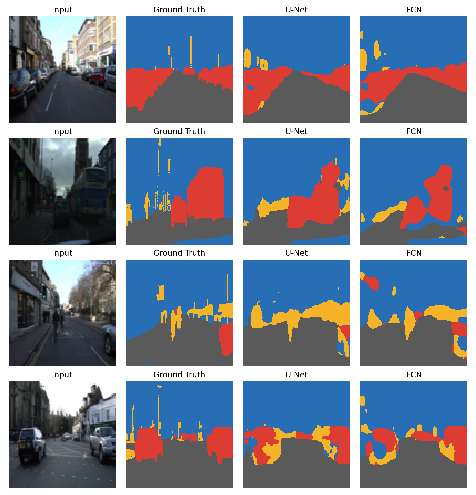
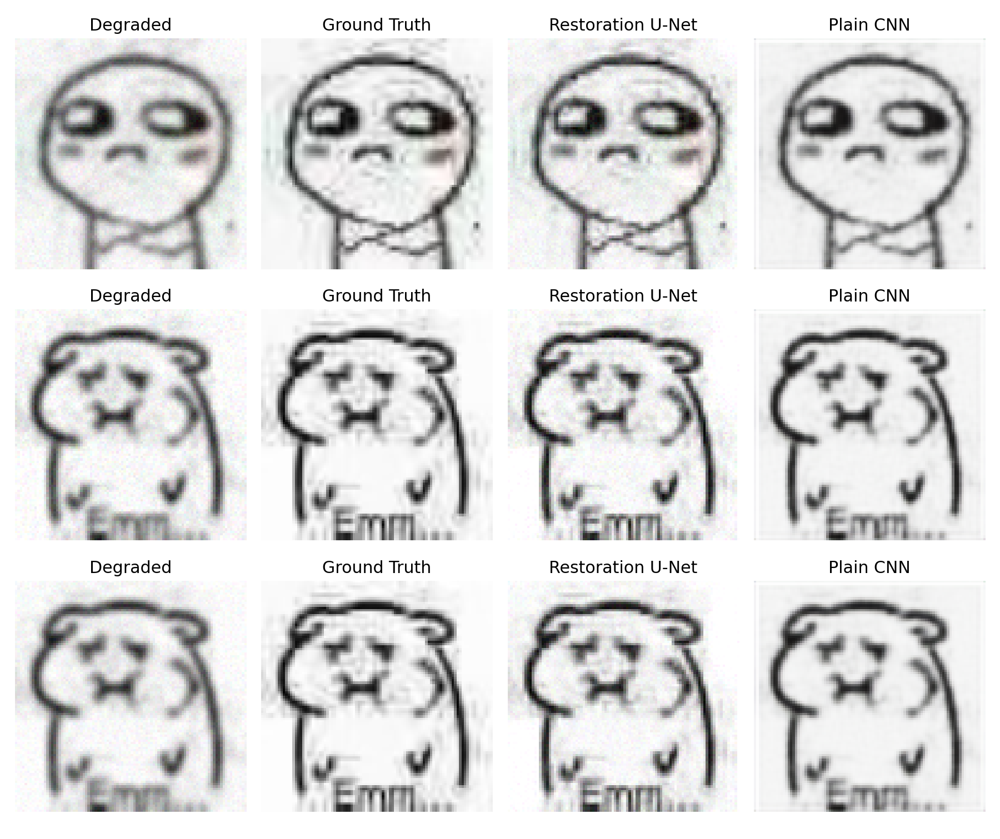

# U-Net 道路场景图像分割与清晰度还原实验报告

## 1. 实验目的

本实验以 U-Net 为主题，面向道路应用场景完成两类任务：

1. 道路场景语义分割：将真实驾驶场景图像划分为背景、道路、车辆和障碍物四类。
2. 图像清晰度还原：将低清、模糊、含噪图像恢复为更接近清晰目标图的结果。

实验重点是比较 U-Net 与其他网络结构的差异。分割部分比较 U-Net 和 FCN；还原部分比较残差式 Restoration U-Net 和 Plain CNN。

道路场景具有明确应用价值。道路区域、车辆和障碍物识别是自动驾驶、辅助驾驶、道路巡检和移动机器人导航中的基础视觉任务，因此适合作为课程大作业案例。

## 2. 实验环境

| 项目 | 配置 |
|---|---|
| 操作系统 | Windows |
| Python | 3.13.13 |
| 深度学习框架 | PyTorch |
| 主要依赖 | numpy, Pillow, matplotlib, scikit-image, tqdm |
| 训练设备 | CUDA |
| 数据集 | CamVid Tiny |
| 图像尺寸 | 96 x 96 |
| 分割训练集规模 | 80 |
| 分割验证集规模 | 20 |
| 还原训练样本数 | 96 |
| 还原验证样本数 | 12 |
| Batch Size | 8 |
| 随机种子 | 42 |

## 3. 数据集与任务构造

### 3.1 CamVid 道路场景分割数据

本实验使用公开道路场景数据集 CamVid 的小规模真实子集 `camvid_tiny`。CamVid 图像来自驾驶视角，提供像素级语义标签，适合用于道路场景理解任务。

为了贴合本课程项目需求，本实验将 CamVid 原始类别合并为四类：

| 项目类别 | CamVid 原始类别示例 | 含义 |
|---|---|---|
| background | Sky, Building, Tree, Wall 等 | 天空、建筑、树木、墙面等背景 |
| road | Road, RoadShoulder, Sidewalk, LaneMkgsDriv, LaneMkgsNonDriv | 路面、路肩、人行道和车道线 |
| vehicle | Car, SUVPickupTruck, Truck_Bus, Train, MotorcycleScooter | 车辆类目标 |
| obstacle | Pedestrian, Bicyclist, TrafficCone, TrafficLight, SignSymbol, Column_Pole, Fence 等 | 行人、骑行者、锥桶、标志、杆、围栏等道路目标 |

真实数据比生成数据更复杂，包含光照变化、遮挡、模糊、透视变化和类别不均衡，因此指标会低于生成数据，但更有实际应用意义。

### 3.2 图像清晰度还原数据

图像还原实验优先读取 `img/` 目录下最多 3 张图片作为清晰目标图。当前实验使用 `img/1.jpg`、`img/2.jpg`、`img/3.jpg`。如果 `img/` 为空，脚本会使用 CamVid 真实图片作为还原源图。

退化方式包括：

- 降采样和上采样，模拟低分辨率；
- Gaussian Blur，模拟镜头模糊或运动模糊；
- 随机噪声，模拟采集噪声。

模型输入为退化图像，目标为原始清晰图像。

## 4. 模型设计

### 4.1 U-Net 分割模型

U-Net 使用编码器-解码器结构。编码器通过卷积和池化提取高层语义信息；解码器通过上采样恢复空间分辨率；skip connection 将编码器中同尺度的浅层特征拼接到解码器中。

skip connection 是 U-Net 的关键。它可以把浅层边缘、位置和纹理信息补回解码阶段，使模型在像素级预测中更容易恢复边界和小目标。

### 4.2 FCN 分割基线

FCN 同样使用卷积、池化和上采样完成像素级分类，但没有 U-Net 的同尺度跳跃连接。因此它更依赖瓶颈层之后的上采样特征，容易损失细粒度边界信息。

### 4.3 Restoration U-Net

图像还原模型采用残差式 U-Net。模型不是直接生成整张清晰图，而是学习退化图到清晰图之间的残差修正量：

```text
restored image = degraded image + predicted residual
```

这种设计适合图像复原任务。低清输入中仍然包含整体结构，模型只需要重点学习去噪、锐化和局部修正。

### 4.4 Plain CNN 基线

Plain CNN 由连续卷积层组成，不做显式下采样和上采样。它参数量更少，适合作为局部像素映射基线。与 Restoration U-Net 对比，可以观察多尺度结构和残差学习是否带来收益。

## 5. 训练与评价指标

分割任务使用带类别权重的 Cross Entropy Loss。由于 CamVid 中车辆和障碍物像素占比较低，类别权重可以减少模型只偏向背景和道路的风险。

评价指标包括：

| 指标 | 含义 |
|---|---|
| mIoU(all) | 所有类别 IoU 的平均值 |
| mIoU(foreground) | road、vehicle、obstacle 三个前景类别 IoU 的平均值 |
| Pixel Accuracy | 像素分类准确率 |
| Class IoU | 单个类别的交并比 |

图像还原任务使用 MSE Loss。评价指标包括：

| 指标 | 含义 |
|---|---|
| MSE | 像素均方误差，越低越好 |
| PSNR | 峰值信噪比，越高越好 |
| SSIM | 结构相似度，越高越好 |

## 6. 实验结果

### 6.1 分割结果

| 模型 | mIoU(all) | mIoU(foreground) | Pixel Accuracy | 参数量 |
|---|---:|---:|---:|---:|
| U-Net | 0.6501 | 0.5842 | 0.8896 | 117,732 |
| FCN | 0.6136 | 0.5355 | 0.8829 | 35,894 |

各类别 IoU 如下：

| 类别 | U-Net IoU | FCN IoU |
|---|---:|---:|
| background | 0.8476 | 0.8480 |
| road | 0.9179 | 0.8886 |
| vehicle | 0.6185 | 0.5233 |
| obstacle | 0.2161 | 0.1946 |

分割结果图：



结果显示，U-Net 在整体 mIoU、前景 mIoU 和像素准确率上都优于 FCN。车辆类 IoU 提升较明显，说明 skip connection 对恢复小目标和边界有帮助。障碍物类 IoU 较低，主要原因是该类别由多个小类别合并而来，目标形状差异大、像素占比低。

### 6.2 清晰度还原结果

| 模型/输入 | MSE | PSNR | SSIM | 参数量 |
|---|---:|---:|---:|---:|
| Degraded input | 0.003953 | 24.5616 | 0.8627 | - |
| Restoration U-Net | 0.000530 | 32.9873 | 0.9466 | 117,715 |
| Plain CNN | 0.001796 | 27.7895 | 0.9300 | 20,259 |

还原结果图：



Restoration U-Net 相比退化输入明显降低 MSE，并将 PSNR 从 24.5616 dB 提升到 32.9873 dB，SSIM 从 0.8627 提升到 0.9466。Plain CNN 也有提升，但三个指标均低于 Restoration U-Net。

## 7. 结果分析

分割实验表明，U-Net 的优势主要体现在小目标和边界恢复上。道路场景中，车辆和障碍物面积较小，如果只依赖深层低分辨率特征，上采样时容易丢失位置细节。U-Net 通过 skip connection 将浅层空间信息传回解码器，因此能够更准确地恢复目标边界。

还原实验表明，残差式 U-Net 比 Plain CNN 更适合该任务。图像还原不是从零生成图像，而是在已有退化图基础上修正模糊和噪声。残差学习保留了输入图的整体结构，多尺度 U-Net 则提供了更大的感受野和更强的上下文建模能力。

## 8. 局限性与改进方向

当前实验使用 CamVid Tiny，优点是下载快、复现稳定；不足是数据规模较小，障碍物类别样本不足。完整 CamVid 或 Cityscapes 能提供更充分的训练数据，但下载和整理成本更高。

当前图像分辨率为 96 x 96，模型规模也较小。提高分辨率、增加训练轮数和模型宽度，有可能进一步提升结果。

进一步改进方向包括：

- 使用完整 CamVid 训练更多样本；
- 使用 Cityscapes 或 BDD100K 做更大规模道路场景分割；
- 将 obstacle 拆成 pedestrian、sign、pole、traffic cone 等细分类；
- 尝试 DeepLabV3、SegNet、U-Net++ 等分割网络；
- 在还原任务中加入 L1 Loss、SSIM Loss 或感知损失。

## 9. 复现实验方法

在仓库根目录运行：

```bash
python run_road_experiments.py --seg-dataset camvid_tiny --epochs 25 --train-count 80 --val-count 20 --restore-train-count 96 --restore-val-count 12 --batch-size 8 --size 96 --output-dir outputs_camvid
```

运行完成后会生成：

| 文件 | 说明 |
|---|---|
| `outputs_camvid/metrics.json` | 实验配置、指标和训练历史 |
| `outputs_camvid/figures/segmentation_examples.png` | 分割可视化对比 |
| `outputs_camvid/figures/segmentation_loss.png` | 分割验证损失曲线 |
| `outputs_camvid/figures/restoration_examples.png` | 图像还原可视化对比 |
| `outputs_camvid/figures/restoration_loss.png` | 还原验证损失曲线 |

## 10. 总结

本实验使用公开 CamVid 道路场景数据完成了 U-Net 图像分割和图像清晰度还原两项任务。分割结果显示，U-Net 在 mIoU、前景 mIoU 和像素准确率上均优于 FCN，尤其在车辆和障碍物小目标上更稳定。还原结果显示，Restoration U-Net 相比退化输入和 Plain CNN 均取得更好的 MSE、PSNR 和 SSIM。

整体来看，U-Net 的编码器-解码器结构和 skip connection 适合需要空间细节恢复的视觉任务；残差式 U-Net 也可以迁移到图像复原任务中，用于改善低清、模糊和含噪图像的质量。
