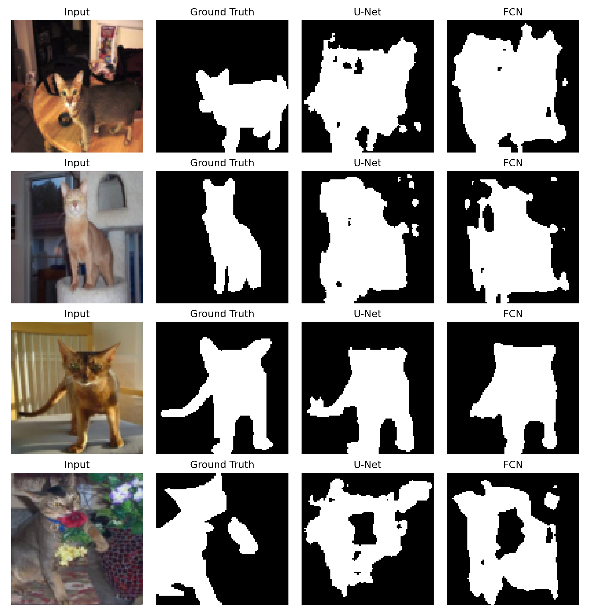
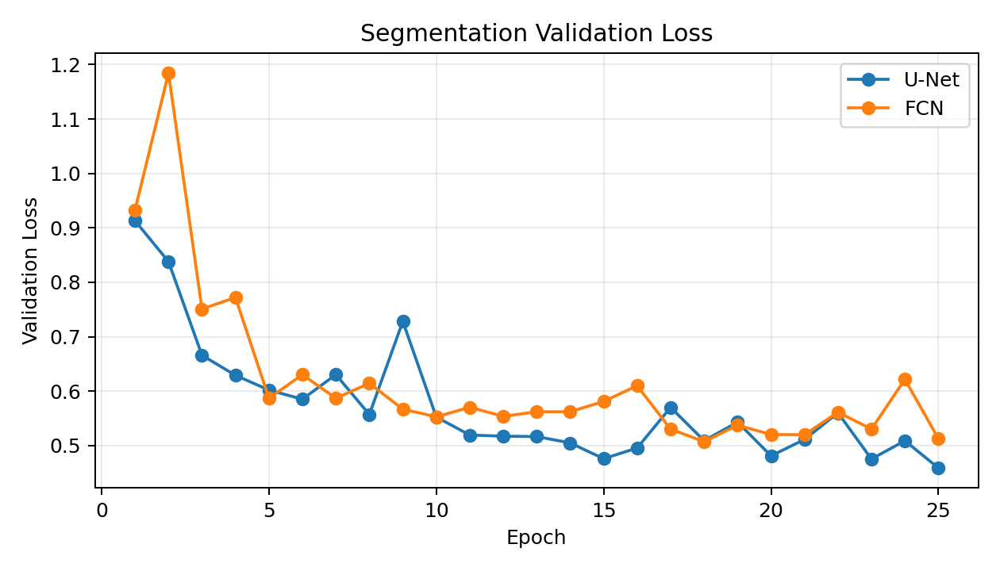
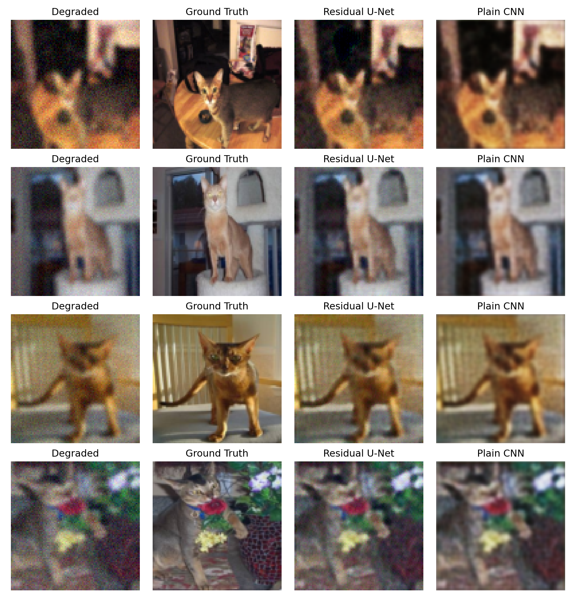
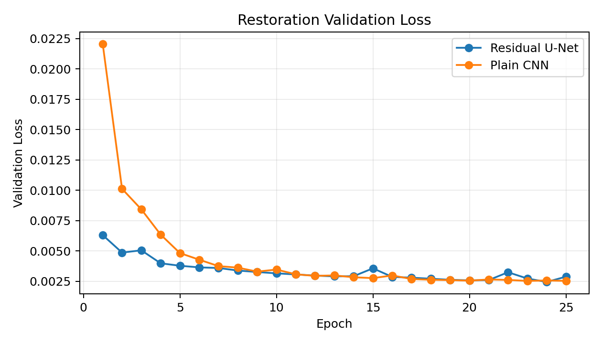

# U-Net 图像分割与图像清晰度还原实验报告

## 1. 实验目的

本实验以 U-Net 为主题，完成两个相关任务：

1. 图像分割：比较 U-Net 与无跳跃连接的轻量 FCN 在目标区域分割上的效果差异。
2. 图像清晰度还原：比较 Residual U-Net 与普通卷积神经网络 Plain CNN 在模糊、降采样、噪声退化图像上的还原效果差异。

实验重点是结合真实应用场景，观察 U-Net 的核心结构特征：编码器-解码器结构、跳跃连接、多尺度语义与浅层细节融合。本实验选择宠物图像前景分割和宠物图像清晰度还原作为应用任务。

## 2. 实验环境

| 项目 | 配置 |
|---|---|
| 操作系统 | Windows |
| Python | 3.13.13 |
| 深度学习框架 | PyTorch |
| 主要依赖 | numpy, Pillow, matplotlib, scikit-image, tqdm |
| 训练设备 | CUDA |
| 数据集 | Oxford-IIIT Pet |
| 图像尺寸 | 96 x 96 |
| 训练集规模 | 512 张 |
| 验证集规模 | 128 张 |
| 训练轮数 | 25 |
| Batch Size | 32 |
| 随机种子 | 42 |

## 3. 数据集构造

本实验使用 Oxford-IIIT Pet 真实数据集。该数据集包含猫、狗等宠物照片，并提供宠物主体的 trimap 标注，适合用于宠物前景分割、背景替换、相册智能编辑等应用场景。

分割任务中，输入为真实 RGB 宠物图像，标签由 trimap 转换为二值前景掩膜。由于真实图片包含复杂背景、毛发边缘、姿态变化和遮挡，因此任务难度明显高于合成几何图像。

图像还原任务中，使用真实宠物图像作为清晰目标，再对其进行降采样、上采样、Gaussian Blur 和随机噪声扰动，得到退化图像。模型输入退化图像，学习恢复到原始清晰图像。

## 4. 模型设计

### 4.1 U-Net

U-Net 使用两层下采样编码器、一个瓶颈层和两层上采样解码器。解码阶段通过跳跃连接拼接同尺度编码器特征，使模型同时获得高级语义信息和浅层空间细节。

在分割任务中，U-Net 输出 1 通道 mask logits；在图像还原任务中，本实验使用 Residual U-Net 输出退化图像到清晰图像之间的残差修正量。

参数量：

| 任务 | 模型 | 参数量 |
|---|---:|---:|
| 分割 | U-Net | 66,469 |
| 还原 | Residual U-Net | 117,715 |

### 4.2 对比模型

分割对比模型为轻量 FCN。它同样使用卷积、池化和上采样，但没有 U-Net 的同尺度跳跃连接，因此在恢复边界和小目标时更依赖瓶颈后的上采样特征。

图像还原主模型为 Residual U-Net。它保留 U-Net 的编码器-解码器和跳跃连接结构，同时不直接从零生成清晰图像，而是学习退化图像到清晰图像之间的残差修正：

```text
restored image = degraded image + predicted residual
```

图像还原对比模型为 Plain CNN，由连续卷积层组成，不进行显式下采样。它参数较少，保留完整空间分辨率，适合作为局部像素映射基线。

参数量：

| 任务 | 模型 | 参数量 |
|---|---:|---:|
| 分割 | FCN | 23,049 |
| 还原 | Plain CNN | 20,259 |

## 5. 训练与评价指标

分割任务使用 BCEWithLogitsLoss 与 Dice Loss 的组合损失：

```text
Loss = 0.5 * BCE + (1 - Dice)
```

评价指标包括：

| 指标 | 含义 |
|---|---|
| mIoU | 预测区域与真实区域的平均交并比 |
| Dice | 分割任务常用重叠指标，对小目标较敏感 |
| Pixel Accuracy | 像素级分类准确率 |

图像还原任务使用 MSE Loss。评价指标包括：

| 指标 | 含义 |
|---|---|
| MSE | 像素均方误差，越低越好 |
| PSNR | 峰值信噪比，越高越好 |
| SSIM | 结构相似性，越高越好 |

## 6. 实验结果

### 6.1 图像分割结果

| 模型 | mIoU | Dice | Pixel Accuracy |
|---|---:|---:|---:|
| U-Net | 0.6807 | 0.8007 | 0.8220 |
| FCN | 0.6408 | 0.7728 | 0.8026 |

分割示例：



从结果看，U-Net 在真实宠物图像上取得了高于轻量 FCN 的 mIoU、Dice 和像素准确率。真实数据中的毛发、背景杂物和姿态变化会导致预测边界不如合成数据平滑，但 U-Net 仍能更好地利用跳跃连接恢复主体区域。

训练损失曲线：



### 6.2 图像清晰度还原结果

| 模型/输入 | MSE | PSNR | SSIM |
|---|---:|---:|---:|
| Degraded input | 0.004062 | 24.2574 | 0.6143 |
| Residual U-Net | 0.002449 | 26.4851 | 0.7526 |
| Plain CNN | 0.002536 | 26.3481 | 0.8141 |

还原示例：



图像还原结果显示，Residual U-Net 相比退化输入显著降低 MSE，并将 PSNR 从 24.2574 dB 提升到 26.4851 dB。与 Plain CNN 相比，Residual U-Net 的 MSE 和 PSNR 略优，说明其像素误差更低；Plain CNN 的 SSIM 更高，说明其在结构相似性指标上更占优。因此真实图像复原需要结合多个指标和可视化结果综合分析。

训练损失曲线：



## 7. 结果分析

U-Net 在分割任务上表现更好，核心原因是语义分割需要同时判断“目标是什么”和“目标在哪里”。编码器通过下采样获得更大感受野，解码器恢复空间分辨率，而跳跃连接补充浅层边缘和位置信息。因此，U-Net 对边界、小目标和多目标区域更友好。

图像还原任务中，Residual U-Net 与 Plain CNN 各有优势。Residual U-Net 的 MSE 和 PSNR 更好，说明整体像素误差更低；Plain CNN 的 SSIM 更高，说明它在局部结构平滑性上表现更强。原因可能是 Plain CNN 始终保持原始空间分辨率，更适合局部纹理映射，而 Residual U-Net 的多尺度结构更擅长整体修正。

因此，本实验可以得到两个结论：

1. U-Net 的跳跃连接对图像分割非常有效，尤其适合需要精确定位的像素级预测任务。
2. 对图像清晰度还原任务，Residual U-Net 的 MSE/PSNR 略优，Plain CNN 的 SSIM 更高，说明图像复原任务应结合多个指标评价。

## 8. 局限性与改进方向

本实验使用真实 Oxford-IIIT Pet 数据集，但受时间和算力限制，只抽取了 512 张训练图像和 128 张验证图像，模型规模也较小。因此分割结果仍有提升空间。

图像还原部分当前使用 MSE Loss，容易得到平滑结果。后续可以加入 L1 Loss、SSIM Loss、感知损失，或者使用残差学习结构，例如 DnCNN、RED-Net、ResUNet 等。

当前模型规模较小，训练轮数也较少。若进一步增加数据量、训练 epoch 和模型宽度，结果可能发生变化。

## 9. 复现实验方法

在当前目录下执行：

```bash
python run_experiments.py --dataset pet --epochs 25 --train-count 512 --val-count 128 --batch-size 32 --size 96 --output-dir outputs_pet
```

运行完成后会生成：

| 文件 | 说明 |
|---|---|
| `outputs_pet/metrics.json` | 实验配置、指标和训练历史 |
| `outputs_pet/figures/segmentation_examples.png` | 分割可视化对比图 |
| `outputs_pet/figures/restoration_examples.png` | 图像还原可视化对比图 |
| `outputs_pet/figures/segmentation_loss.png` | 分割验证损失曲线 |
| `outputs_pet/figures/restoration_loss.png` | 还原验证损失曲线 |

## 10. 总结

本实验围绕 U-Net 完成了真实宠物图像分割和图像清晰度还原两个任务。分割实验中，U-Net 相比轻量 FCN 获得更高 mIoU 和 Dice，验证了跳跃连接在像素级定位任务中的优势。图像还原实验中，Residual U-Net 相比退化输入显著提升 MSE 和 PSNR，并在 MSE/PSNR 上略优于 Plain CNN；Plain CNN 在 SSIM 上更高，说明不同结构在图像复原任务中有不同优势。
